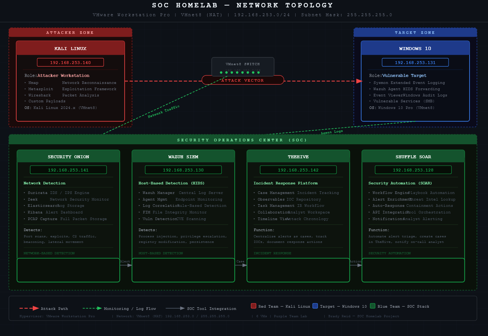

# 🛡️ SOC Homelab - Enterprise Security Operations Center

> **A production-grade Security Operations Center built for hands-on cybersecurity training, threat detection, and incident response simulation.**

[](https://www.kali.org/)
[](https://securityonionsolutions.com/)
[](https://wazuh.com/)
[](https://thehive-project.org/)
[](https://shuffler.io/)

---

## 📋 Table of Contents

- [Overview](#-overview)
- [Architecture](#-architecture)
- [Lab Components](#-lab-components)
- [Network Topology](#-network-topology)
- [Installation & Setup](#-installation--setup)
- [Attack Scenarios](#-attack-scenarios)
- [Detection & Response](#-detection--response)
- [Screenshots & Evidence](#-screenshots--evidence)
- [Skills Demonstrated](#-skills-demonstrated)
- [Future Enhancements](#-future-enhancements)
- [Resources](#-resources)

---

## 🎯 Overview

This SOC Homelab simulates a **real-world enterprise security operations center** where I practice:

- **Offensive Security** - Executing attacks using industry-standard exploitation frameworks
- **Network & Host Detection** - Identifying malicious activity through NIDS/HIDS
- **Incident Response** - Triaging, analyzing, and responding to security incidents
- **Security Automation** - Building SOAR workflows for automated threat response

### 🔑 Key Objectives

✅ Build detection engineering skills using real attack data  
✅ Practice incident response workflows from alert to remediation  
✅ Understand attacker tactics, techniques, and procedures (TTPs)  
✅ Develop SOAR automation playbooks for common threats  
✅ Create a portfolio-ready cybersecurity project  

---

## 🏗️ Architecture

### Infrastructure

- **Hypervisor:** VMware Workstation Pro
- **Network:** VMnet8 (NAT) - Isolated Lab Network
- **Subnet:** `192.168.253.0/24`
- **Total VMs:** 6 (1 Attacker, 1 Target, 4 SOC Tools)

### Design Philosophy

This lab follows the **Purple Team** approach:
- **Red Team (Attacker):** Kali Linux executes real-world attacks
- **Blue Team (Defender):** SOC stack detects, analyzes, and responds

All network traffic is isolated in VMnet8 to prevent accidental attacks on production networks.

---

## 🖥️ Lab Components

### Offensive Platform

| Component | IP Address | Role | Key Tools |
|-----------|------------|------|-----------|
| **Kali Linux** | `192.168.253.140` | Attacker Workstation | Nmap, Metasploit, Wireshark |

### Target Environment

| Component | IP Address | Role | Monitoring |
|-----------|------------|------|------------|
| **Windows 10** | `192.168.253.131` | Vulnerable Target | Sysmon, Wazuh Agent, Event Viewer |

### Security Operations Center (SOC)

| Component | IP Address | Role | Capabilities |
|-----------|------------|------|--------------|
| **Security Onion** | `192.168.253.141` | Network Detection | Suricata IDS, Zeek NSM, Elasticsearch, Kibana |
| **Wazuh** | `192.168.253.130` | Host Detection (SIEM) | Log correlation, FIM, Vulnerability detection |
| **TheHive** | `192.168.253.142` | Incident Response Platform | Case management, IOC tracking, Collaboration |
| **Shuffle** | `192.168.253.128` | SOAR Automation | Workflow orchestration, API integration |

---

## 🗺️ Network Topology

[](https://github.com/Brady0Reid/SOC-Homelab/blob/main/screenshots/01-network-topology/vmware-network-config.png)


### Traffic Flow

1. **Attack Vector** 🔴 Kali (`192.168.253.140`) → Windows Target (`192.168.253.131`)
2. **Network Monitoring** 🟢 All traffic → Security Onion (`192.168.253.141`)
3. **Host Monitoring** 🟢 Windows logs → Wazuh (`192.168.253.130`)
4. **Alert Pipeline** 🟡 Wazuh → TheHive → Shuffle (automated response)

---

## 🚀 Installation & Setup

### Prerequisites

- VMware Workstation Pro 17+ (or VMware Player)
- 32 GB RAM recommended (minimum 16 GB)
- 500 GB storage
- Host OS: Windows 10/11 or Linux

### VM Configuration

```
┌─────────────────────────────────────────────────────────────┐
│ VM Name           │ RAM   │ CPU   │ Disk  │ OS              │
├─────────────────────────────────────────────────────────────┤
│ Kali Linux        │ 4 GB  │ 2     │ 80 GB │ Kali 2024.x     │
│ Windows 10        │ 4 GB  │ 2     │ 60 GB │ Windows 10 Pro  │
│ Security Onion    │ 8 GB  │ 4     │ 200GB │ Ubuntu 20.04    │
│ Wazuh             │ 4 GB  │ 2     │ 50 GB │ Ubuntu 22.04    │
│ TheHive           │ 4 GB  │ 2     │ 50 GB │ Ubuntu 22.04    │
│ Shuffle           │ 2 GB  │ 2     │ 30 GB │ Ubuntu 22.04    │
└─────────────────────────────────────────────────────────────┘
```

### Quick Start

1. **Setup VMnet8 Network**
   ```
   VMware → Edit → Virtual Network Editor
   - Select VMnet8 (NAT)
   - Subnet: 192.168.253.0/24
   - Enable DHCP or use static IPs
   ```

2. **Install VMs**
   - Deploy all 6 VMs on VMnet8
   - Configure static IPs as per topology
   - Verify connectivity: `ping` between all hosts

3. **Configure SOC Tools**
   - Security Onion: Run setup, enable Suricata + Zeek
   - Wazuh: Install manager, deploy agent to Windows
   - TheHive: Configure API keys
   - Shuffle: Build initial workflows

Full installation guides are in `/documentation/setup-guides/`

---

## ⚔️ Attack Scenarios

### Planned Attack Chains

These scenarios will be documented with full screenshots and PCAP evidence:

#### 1. **Reconnaissance & Scanning**
- [ ] Nmap network sweep (`192.168.253.0/24`)
- [ ] Service enumeration on Windows target
- [ ] OS fingerprinting
- [ ] **Detection:** Suricata alerts on port scans

#### 2. **Initial Access - SMB Exploitation**
- [ ] EternalBlue (MS17-010) exploitation
- [ ] Metasploit payload delivery
- [ ] Meterpreter session establishment
- [ ] **Detection:** Wazuh alerts on suspicious process creation

#### 3. **Privilege Escalation**
- [ ] Windows token impersonation
- [ ] UAC bypass techniques
- [ ] SYSTEM-level access achieved
- [ ] **Detection:** Sysmon Event ID 10 (Process Access)

#### 4. **Persistence**
- [ ] Registry Run key modification
- [ ] Scheduled task creation
- [ ] **Detection:** Wazuh FIM alerts on registry changes

#### 5. **Credential Access**
- [ ] Mimikatz - Dump LSASS credentials
- [ ] Pass-the-Hash attack
- [ ] **Detection:** Wazuh detects LSASS access

#### 6. **Lateral Movement**
- [ ] PSExec to additional targets (if expanded)
- [ ] **Detection:** Network anomaly detection

#### 7. **Exfiltration Simulation**
- [ ] Data staging and compression
- [ ] DNS tunneling / HTTPS exfil
- [ ] **Detection:** Zeek DNS anomalies

---

## 🛡️ Detection & Response

### Detection Layer 1: Network (Security Onion)

**Suricata Rules Triggered:**
- `ET SCAN Nmap Scripting Engine User-Agent Detected`
- `GPL ATTACK_RESPONSE id check returned root`
- `ET EXPLOIT Possible MS17-010 SMB Echo Response`

**Zeek Logs:**
- `conn.log` - Full connection records
- `dns.log` - DNS queries (C2 detection)
- `files.log` - File transfers
- `pe.log` - Portable executable analysis

### Detection Layer 2: Host (Wazuh)

**Alert Categories:**
- Windows Event Log correlation (Security, System, Sysmon)
- File Integrity Monitoring (FIM) on critical paths
- Rootkit detection scans
- Vulnerability assessments

**Custom Rules:**
```xml
<!-- Example: Detect Metasploit Meterpreter -->
<rule id="100001" level="12">
  <if_sid>18104</if_sid>
  <match>meterpreter|metsrv</match>
  <description>Metasploit Meterpreter detected</description>
  <mitre>
    <id>T1059</id>
  </mitre>
</rule>
```

### Response Layer: TheHive + Shuffle

**Incident Response Workflow:**

1. **Alert Generation** → Wazuh/Security Onion detect malicious activity
2. **Case Creation** → Shuffle auto-creates TheHive case
3. **Enrichment** → Shuffle queries threat intel APIs (VirusTotal, AbuseIPDB)
4. **Analyst Review** → TheHive case assigned to analyst (me)
5. **Containment** → Shuffle workflow isolates affected host
6. **Eradication** → Document remediation steps
7. **Recovery** → Restore from clean snapshot
8. **Lessons Learned** → Update detection rules

---

## 📸 Screenshots & Evidence

Screenshots will be organized in `/screenshots/` by attack phase:

```
screenshots/
├── 01-network-topology/
│   └── vmware-network-config.png
├── 02-reconnaissance/
│   ├── nmap-network-scan.png
│   └── service-enumeration.png
├── 03-exploitation/
│   ├── metasploit-eternalblue.png
│   └── meterpreter-session.png
├── 04-detection/
│   ├── security-onion-alerts.png
│   ├── wazuh-dashboard.png
│   └── sysmon-event-logs.png
├── 05-incident-response/
│   ├── thehive-case-created.png
│   ├── shuffle-workflow.png
│   └── remediation-steps.png
└── 06-pcap-analysis/
    └── wireshark-attack-traffic.png
```

---

## 💡 Skills Demonstrated

### Technical Competencies

- ✅ **Network Security Monitoring (NSM)** - Zeek, Suricata
- ✅ **SIEM Configuration** - Wazuh log correlation, custom rules
- ✅ **Incident Response** - TheHive case management, forensic analysis
- ✅ **Security Automation (SOAR)** - Shuffle workflow development
- ✅ **Penetration Testing** - Metasploit, Nmap, post-exploitation
- ✅ **Log Analysis** - Windows Event Logs, Sysmon, Linux syslogs
- ✅ **Threat Hunting** - MITRE ATT&CK mapping, IOC identification
- ✅ **Virtualization** - VMware networking, VM management

### Security Frameworks

- **MITRE ATT&CK** - Mapping attacks to tactics and techniques
- **Cyber Kill Chain** - Understanding attack progression
- **NIST Cybersecurity Framework** - Detect, Respond, Recover

### Tools Proficiency

| Category | Tools |
|----------|-------|
| **SIEM** | Wazuh, Elasticsearch, Kibana |
| **IDS/IPS** | Suricata, Zeek (Bro) |
| **IR Platform** | TheHive, Cortex |
| **SOAR** | Shuffle |
| **Offensive** | Metasploit, Nmap, Wireshark |
| **Forensics** | Sysmon, Event Viewer, PCAP analysis |

---

## 🚧 Future Enhancements

### Phase 2 Additions

- [ ] Add **Active Directory** domain environment
- [ ] Deploy **pfSense** firewall for traffic segmentation
- [ ] Implement **Velociraptor** for endpoint forensics
- [ ] Add **MISP** threat intelligence platform
- [ ] Create **honeypot** (Cowrie SSH/Telnet)
- [ ] Build **custom Suricata rules** for specific threats
- [ ] Integrate **VirusTotal** API with Shuffle
- [ ] Add **Ubuntu Server** as secondary target

### Advanced Scenarios

- [ ] Kerberoasting attacks in AD environment
- [ ] Golden Ticket attacks
- [ ] Living-off-the-Land (LOLBins) techniques
- [ ] Fileless malware simulation
- [ ] Ransomware attack chain (isolated, non-destructive)

---

## 📚 Resources

### Documentation

- [Security Onion Documentation](https://docs.securityonion.net/)
- [Wazuh Documentation](https://documentation.wazuh.com/)
- [TheHive Documentation](https://docs.thehive-project.org/)
- [Shuffle Documentation](https://shuffler.io/docs)
- [MITRE ATT&CK Framework](https://attack.mitre.org/)

### Learning References

- **Books:** "The Practice of Network Security Monitoring" by Richard Bejtlich
- **Courses:** TryHackMe SOC Level 1 Path, HackTheBox Academy
- **YouTube:** John Hammond, NetworkChuck, IppSec

---

## 🤝 Connect

This project demonstrates real-world SOC operations skills for **entry-level SOC Analyst** and **Cloud Security** roles.

[](https://www.linkedin.com/in/brady-reidin)
[](https://github.com/Brady0Reid)

---

> *"The best defense is a good understanding of the offense."*

**Project Status:** 🟡 In Progress - Baseline configuration complete, attack scenarios in development

**Last Updated:** February 2025
